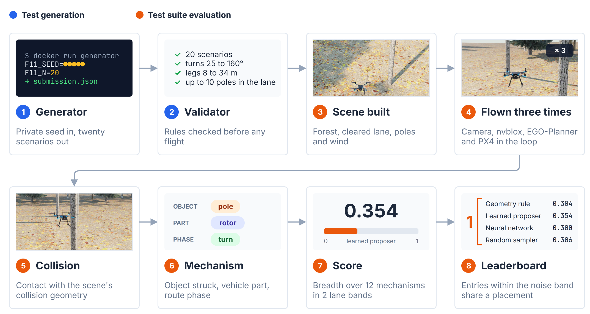
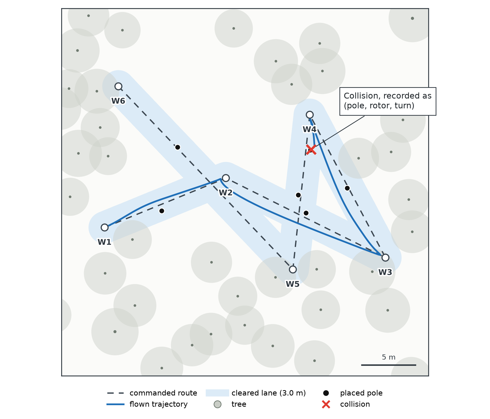
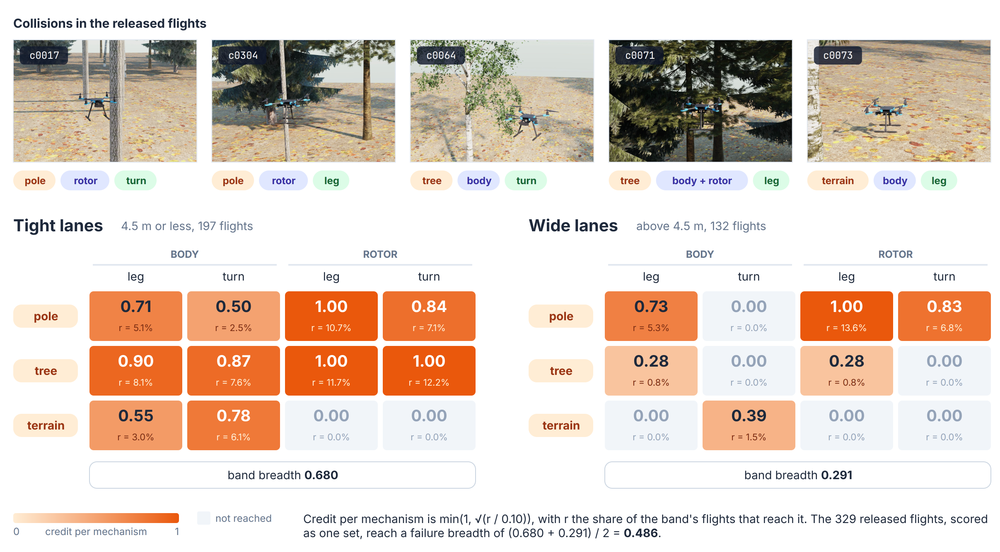

# UAV Perception Testing Track

A tool competition on test scenario generation for autonomous UAVs, proposed for the [ICST 2027 Challenge Competition Track](https://conf.researchr.org/track/icst-2027/icst-2027-challenge-competition-track).

A submission is a **scenario generator**. It writes forest scenarios: a route, the width of the lane cleared along it, poles placed near the route, tree density, wind, speed and altitude. Each scenario is flown in Isaac Sim by a fixed autonomy stack, and generators are ranked by the **distinct failure mechanisms** their scenarios reach.

Track site: **https://ideals-lab.github.io/uav-testing-track-2027/**

```bash
git clone --single-branch https://github.com/IDeaLS-Lab/uav-testing-track-2027.git
cd uav-testing-track-2027
```

## Contents

1. [Important dates](#important-dates)
2. [How a submission is evaluated](#how-a-submission-is-evaluated)
3. [What counts as a failure](#what-counts-as-a-failure)
4. [Scoring](#scoring)
5. [Scoreboard](#scoreboard)
6. [Building a generator](#building-a-generator)
7. [Rules](#rules)
8. [Data](#data)
9. [Submitting](#submitting)
10. [Organizers and contact](#organizers-and-contact)

## Important dates

Tentative, following the ICST 2027 Challenge Competition Track schedule. Deadlines are anywhere on Earth (UTC-12).

| milestone | date |
| --- | --- |
| competition opens | 1 November 2026 |
| submission deadline | 15 January 2027 |
| notification to participants | 15 February 2027 |
| tool papers and competition report | 28 February 2027 |
| camera-ready | 7 March 2027 |
| presentation at ICST 2027, San Sebastián, Spain | 17 to 21 May 2027 |

## How a submission is evaluated



The generator runs on a seed that is not disclosed in advance and writes twenty scenarios. `validate.py` checks them before any simulation time is spent. Each accepted scenario is flown three times, sixty flights in all, with a limit of 1320 s per flight including simulator start-up. A flight without a usable record counts as invalid for that repeat and is not re-flown.

The system under test is the same for every submission, so a difference in score reflects a difference between generators:

| layer | configuration |
| --- | --- |
| simulator | Isaac Sim 6.0.1 with the Pegasus Simulator extension, procedural forest scenes |
| perception | simulated RGB-D camera with RealSense D455 intrinsics (640 x 480, 87° field of view), nvblox volumetric mapping |
| planner | EGO-Planner |
| autopilot | PX4 in software-in-the-loop, Holybro X500 airframe with a swept radius of 0.444 m |
| middleware | ROS 2 Jazzy |
| adjudication | physics contact against the scene's collision geometry |

## What counts as a failure



*Flight c0017 from the training data. After waypoint W4 a rotor strikes a placed pole, which is recorded as the mechanism (pole, rotor, turn).*

A failure is a **collision** between the vehicle and the scene's collision geometry: a placed pole, a tree or the terrain. The collision ends the flight and is recorded as a **mechanism**: the object struck (pole, tree, terrain), the vehicle part (body, rotor), and the route phase (turn if the strike is within 3.0 m of a waypoint, leg otherwise). There are twelve mechanisms.

- Contacts within 0.5 s of the terminating contact belong to the same strike, so one flight can reach more than one mechanism.
- Reaching the goal, running out of mission time, or passing close to an obstacle without touching it is not a failure.
- A collision without readable contact evidence counts as a crash but reaches no mechanism.

## Scoring



The rank key is **failure breadth** (`mech_rate`). Coverage of the twelve mechanisms is computed separately for tight lanes (4.5 m and below) and wide lanes, and the two are averaged:

```
breadth = mean over the two bands of ( mean over the 12 mechanisms of min(1, sqrt(r / 0.10)) )
```

where `r` is the share of that band's flights that reach the mechanism. An empty band scores zero, so twenty scenarios at one lane width give away half the score. Credit per mechanism saturates, so reaching a new mechanism is worth more than repeating one. Crash count is not ranked, because crash rate and failure breadth can order generators differently: among the sample tools, the random sampler has the lowest crash rate (0.250) and the second-highest breadth (0.306).

Eight diagnostics are reported with every score. There is no weighted total.

| measure | definition |
| --- | --- |
| `mechanism` | share of the six (object, vehicle part) pairs reached at least once |
| `mech_rarity` | coverage of the six pairs, with double weight on a pair no sample tool reached |
| `novelty` | share of the six pairs reached that no sample tool reached |
| `severity` | mean of `clip(1 - m / 1.5)` over flights, with `m` the minimum true clearance |
| `crash` | share of valid flights ending in a collision |
| `output_div` | spread of the flown paths |
| `input_div` | spread of the declared scenario parameters |
| `validity` | share of the twenty scenarios whose flight produced a usable record, averaged over the evaluations |

The validator is the only gate: a submission it rejects is not flown. Entries are ordered by failure breadth averaged over the three evaluations, and an entry within the noise band of a placement's leader shares that placement. Ties are not broken, and entries inside a shared placement are listed alphabetically. The band is published with the board. For a pair of entries it is the half-width of the 95% Welch t interval for the difference of their mean breadths over three evaluations; between the sample tools it ranges from 0.094 to 0.146, and the board uses the widest, 0.146. A band below 0.094 is used only if more than three independent evaluations support it.

## Scoreboard

Four sample tools, each evaluated three times at the full budget:

| place | tool | submitted by | mech_rate | three evaluations | crash | validity |
| --- | --- | --- | --- | --- | --- | --- |
| 1 | geometry rule | sample tool | 0.304 | 0.354, 0.276, 0.281 | 0.500 | 1.000 |
| 1 | learned proposer | sample tool | 0.354 | 0.373, 0.340, 0.349 | 0.600 | 1.000 |
| 1 | neural network | sample tool | 0.300 | 0.323, 0.346, 0.233 | 0.499 | 0.933 |
| 1 | random sampler | sample tool | 0.306 | 0.292, 0.375, 0.250 | 0.250 | 1.000 |

All four lie within the noise band of the leader and share the first placement, so they are listed alphabetically. To be placed ahead of them, a submission needs a breadth more than one band above 0.354, that is, above 0.500. The site lists the other diagnostics for each tool, except rarity and novelty, which are measured against the sample tools themselves.

## Building a generator

A generator is a container image. It reads `F11_SEED` and `F11_N` from the environment, writes the scenarios to `/out/submission.json` and exits 0. At evaluation it has no network, a read-only filesystem with 64 MB of writable `/tmp`, 512 MB of memory, one CPU, no root and 600 s. **The same seed must produce the same bytes**, so every random draw is seeded from `F11_SEED` and the clock, the filesystem and the network are not read.

### Quick start

```bash
cd starter_kit
docker build -t my-generator .

mkdir -p out
docker run --rm --network none --read-only --tmpfs /tmp:rw,size=64m \
  --cap-drop ALL --security-opt no-new-privileges --memory 512m --cpus 1 \
  --user $(id -u):$(id -g) \
  -e F11_SEED=7 -e F11_N=20 -v $PWD/out:/out my-generator

python3 validate.py out/submission.json     # will it be accepted?
python3 preflight.py out/submission.json    # what can be measured before flying
python3 estimate.py out/submission.json     # rough estimate of the rank key
```

These are the flags used at evaluation. To write your own generator, copy `starter_kit/` and replace `generate.py`:

```python
import json, os, random

seed = int(os.environ["F11_SEED"])
n    = int(os.environ["F11_N"])
rng  = random.Random(seed)          # the only source of randomness

scenarios = [my_scenario(rng, i) for i in range(n)]

os.makedirs("/out", exist_ok=True)
with open("/out/submission.json", "w") as f:
    json.dump({"submission": "my-generator", "scenarios": scenarios}, f, indent=1, sort_keys=True)
```

A scenario looks like this. `seed` selects the procedural forest, `corridor` is the width of the lane cleared along the route, and `patrol` is the commanded route:

```json
{
  "id": "s000", "seed": 41835,
  "area": 20.0, "voxel": 0.10, "corridor": 4.5,
  "density": 0.0364, "wind": 1.7, "ego_max_vel": 1.56, "alt": 2.086,
  "patrol": [[8.44, 10.92], [11.65, -5.22]],
  "obstacle": {"type": "poles", "xy": [[9.29, 6.3]], "radius": 0.06, "height": 3.0}
}
```

### Checking before you submit

- `validate.py` is the validator used at evaluation; a rejection there rejects the submission.
- `preflight.py` reports what can be measured without flying: `input_div` exactly, how the scenarios divide between the two lane bands, how close the poles sit to the route, and the tightest free lateral width.
- `estimate.py` approximates the rank key and crash rate from the released flights. Against seven generators flown at the full budget it was off by 0.07 on average and by up to 0.16, so it separates large differences only. The score comes only from the evaluation flights in Isaac Sim.

### Examples

- `examples/random_baseline/` is the smallest generator that passes the validator. It fixes the corridor at 6.0 m, so every scenario falls in the wide band and half the rank key is lost.
- `examples/svm_generator/` shows how to use the training data: a classifier is fitted locally (`python3 train.py ../../data/train/manifest.jsonl -o model.json`), exported as JSON and baked into the image. It places every scenario in the tight band and loses the other half.

## Rules

| rule | value |
| --- | --- |
| scenarios per submission | exactly 20, at least 5 distinct recipes ignoring the forest seed |
| waypoints | 2 to 6 |
| turn at each intermediate waypoint | 25 to 160° |
| leg length | 8.0 to 34.0 m |
| margin from the field edge | 3.0 m |
| poles | at most 10, at least 3.0 m from any waypoint, 1.5 m apart, inside the lane |
| corridor | 2.0 to 12.0 m |
| density | 0.012 to 0.120 |
| wind | 0.0 to 8.0 m/s |
| ego_max_vel | 1.2 to 3.5 m/s |
| alt | 0.5 to 4.0 m |
| area | 10.0 to 40.0 m |
| voxel | 0.05 to 0.20 m |
| pole_radius, pole_height | 0.02 to 0.10 m, 1.0 to 5.0 m |

The turn limit is the most common reason for rejection; check it on the rounded coordinates, since those are written to the file. Tight lanes are not refused: the validator reports lanes that leave less than 0.40 m of free width and marks those under 0.05 m as blocked, but a blocked lane is still admissible because the planner can detour through the forest.

Training and pre-processing are allowed beforehand, for example on `data/train`, provided everything the generator needs is inside the image.

## Data

`data/train/manifest.jsonl` holds 357 flight records: the scenario flown, the route, the obstacles, the outcome, and for each collision the mechanisms it reached (null when the contact record could not be read). `data/train/splits.json` records the fixed train and validation split. This is the whole training signal.

The full collection, with depth, maps, autopilot logs and scene files (336 scenarios, 17.8 GB), is archived at [`merabro/uav-dataset-coverage`](https://huggingface.co/datasets/merabro/uav-dataset-coverage). It is not needed to write a generator; access is granted on request.

## Submitting

1. Build the generator from `starter_kit/` and check it with `validate.py`, `preflight.py` and, if you like, `estimate.py`.
2. Run the container twice on one seed and confirm that `md5sum out/submission.json` matches.
3. Open a pull request that adds `submissions/<team-name>/` with the Dockerfile, `generate.py`, any files the image needs, and a `README.md` of about one page describing the approach. The team name must be unique; do not modify other folders.

Submissions close on 15 January 2027, anywhere on Earth. Participating teams may be invited to submit a tool paper of 2 to 4 pages, including references, in the ICST format. Results are presented at ICST 2027.

<details>
<summary>Differences from the ICST 2026 UAV testing track</summary>

| | ICST 2026 UAV track | this track |
| --- | --- | --- |
| system under test | PX4 with obstacle avoidance, executed through Aerialist | fixed closed-loop stack: RGB-D mapping, planner, PX4 |
| test input | up to three box obstacles added to a given mission | twenty generated forest scenarios |
| failure | crash, or minimum distance to an obstacle below 1.5 m | collision with collision geometry; proximity alone is not a failure |
| budget | 100 simulations per case study, 500 s each | 60 flights per submission, 1320 s each |
| ranking | failure score together with test diversity | breadth of failure mechanisms reached |

</details>

## Organizers and contact

Prakash Aryan, Claudia Ceci, Roberto Riccio, Syed Shaihan, Mohammad Sabouri and Yahya Momtaz.

Open an issue here for questions about the rules, the starter kit or the evaluation. Anything that would reveal an approach to other entrants should be raised with the organizers privately.
